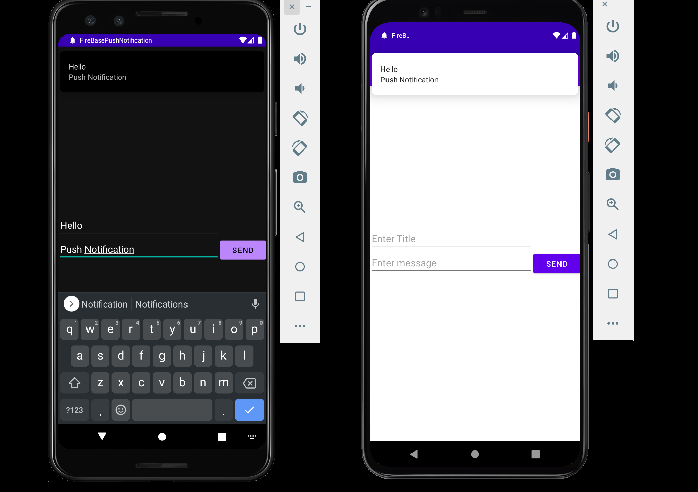

# FireBasePushNotification - DOES NOT WORK
## An Android App of how to push a notification using Firebase Messaging

* New project in -> see -> https://github.com/layonmartins/SendPushNotificationFCM

* Kotlin
* Push Notification
* Firebase Cloud Messaging
* Retrofit

### Reference
* https://www.youtube.com/watch?v=HoFWPPv1ih8
